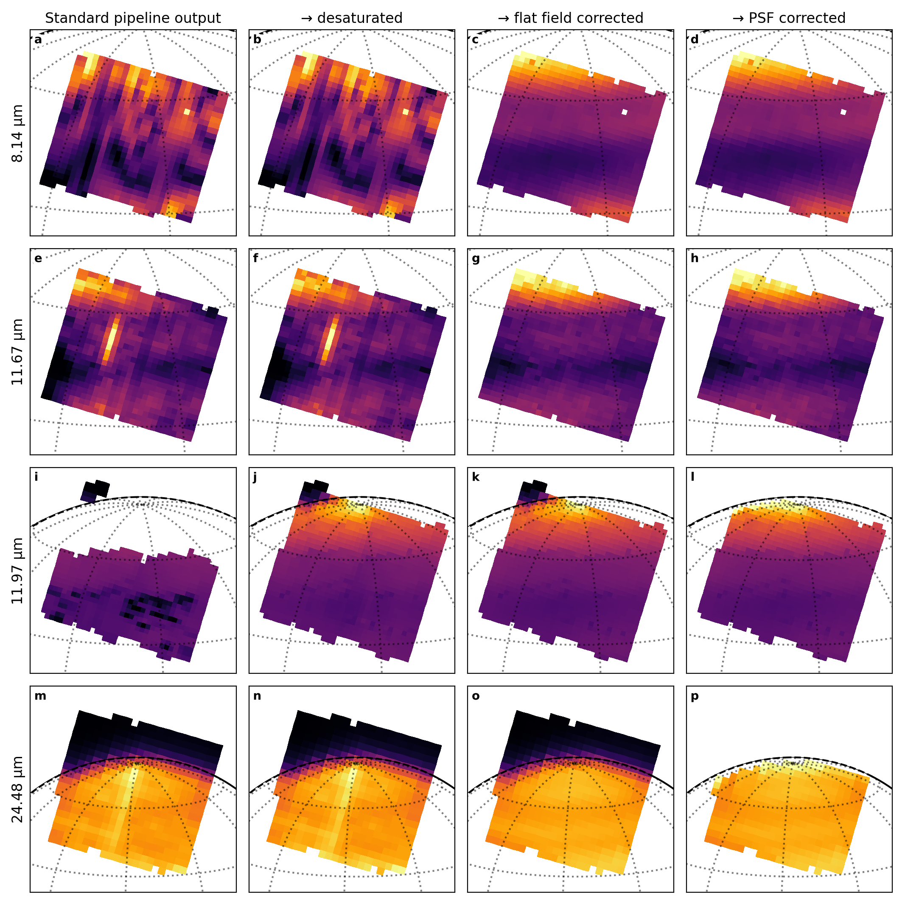
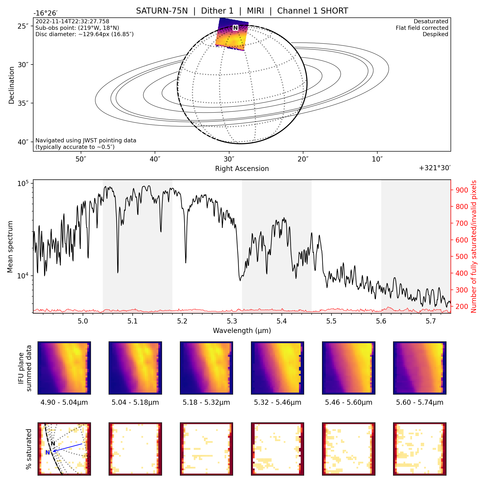

# JWST custom reduction pipelines
**[Reference](#reference) | [Setup](#setup) | [MIRI Pipeline](#miri-mrs-pipeline) | [NIRSpec Pipeline](#nirspec-pipeline) | [Support](#support) | [Examples](#examples)**

Custom JWST data reduction and visualisation code used to call and extend the [standard JWST reduction pipeline](https://github.com/spacetelescope/jwst/) to process, reduce and analyse NIRSpec and MIRI data for solar system observations.

[](https://doi.org/10.3847/2515-5172/ad045f) [](https://doi.org/10.5281/zenodo.7891559) [](https://github.com/JWSTGiantPlanets/pipelines/actions/workflows/checks.yml)

## Reference
> King et al., (2023). Custom JWST NIRSpec/IFU and MIRI/MRS Data Reduction Pipelines for Solar System Targets. Research Notes of the AAS, 7(10), 223, https://doi.org/10.3847/2515-5172/ad045f

<details>
<summary>BibTeX entry</summary>

```bibtex
@article{king_2023_pipelines,
  doi       = {10.3847/2515-5172/ad045f},
  url       = {https://dx.doi.org/10.3847/2515-5172/ad045f},
  year      = {2023},
  month     = {oct},
  publisher = {The American Astronomical Society},
  volume    = {7},
  number    = {10},
  pages     = {223},
  author    = {Oliver R. T. King and Leigh N. Fletcher and Jake Harkett and Michael T. Roman and Henrik Melin},
  title     = {Custom JWST NIRSpec/IFU and MIRI/MRS Data Reduction Pipelines for Solar System Targets},
  journal   = {Research Notes of the AAS},
  abstract  = {We present custom JWST data reduction pipelines for JWST NIRSpec/IFU and MIRI/MRS observations of solar system objects. The pipelines simplify the process of reducing the JWST observations, and include custom steps to significantly improve the data quality. Our custom processing routines include a “desaturation” routine to reduce the effect of saturation while still maintaining high signal-to-noise ratio, and custom flat field correction code to remove the significant artifacts found in MIRI/MRS observations. The pipelines also automatically generate a series of quick look plots and animations to simplify exploration of a dataset. These custom JWST pipelines can be downloaded from https://github.com/JWSTGiantPlanets/pipelines.}
}
```

</details>

Each release is also archived on Zenodo at https://doi.org/10.5281/zenodo.7891559.


## Setup
Requirements:
- Python 3.10 or above
- ~10GB of disk space (for SPICE kernels and the CRDS cache files downloaded when running the JWST data reduction)

To run the pipelines yourself, first create a local clone of this repository with:
```bash
git clone https://github.com/JWSTGiantPlanets/pipelines.git
```

Then install the required Python modules with:
```bash
cd pipelines
pip install -r requirements.txt
```

If it is not already installed, you will also need to install [FFmpeg](https://ffmpeg.org/) to enable the creation of animations from the data cubes. If you are using a conda environment, you can install FFmpeg with:

```bash
conda install -c conda-forge ffmpeg
```

The [standard JWST reduction pipeline](https://github.com/spacetelescope/jwst/) requires the `CRDS_PATH` and `CRDS_SERVER_URL` environment variables to be set to instruct the pipeline where to find and save the various reference files used to reduce the JWST data. These can be set in your `.bashrc` file with:
```bash
export CRDS_PATH="path/to/crds_cache"
export CRDS_SERVER_URL="https://jwst-crds.stsci.edu"
```

The navigation and visualisation pipeline steps use SPICE kernels to calculate the observation geometry. The location that the pipeline looks for the kernels can be set with the `PLANETMAPPER_KERNEL_PATH` environment variable. These can be set in your `.bashrc` file with:
```bash
export PLANETMAPPER_KERNEL_PATH="path/to/spice_kernels"
```
If you don't already have the SPICE kernels downloaded, you will need to download the appropriate set of kernels for your targets and for JWST from the [NAIF archive](https://naif.jpl.nasa.gov/pub/naif/). For information on downloading and saving the SPICE kernels, see the [SPICE kernel documentation for the PlanetMapper module](https://planetmapper.readthedocs.io/en/latest/spice_kernels.html). For example, to download the required kernels for a JWST observation of jupiter, you can run the following in Python:

```python
from planetmapper.kernel_downloader import download_urls
# Ensure you have set the PLANETMAPPER_KERNEL_PATH environment variable before running 
# these commands (otherwise the kernels will be downloaded to the wrong location)

# Standard kernels
download_urls('https://naif.jpl.nasa.gov/pub/naif/generic_kernels/lsk/')
download_urls('https://naif.jpl.nasa.gov/pub/naif/generic_kernels/pck/')

# JWST kernels
download_urls('https://naif.jpl.nasa.gov/pub/naif/JWST/kernels/spk/')

# Locations of planetary system barycentres:
download_urls('https://naif.jpl.nasa.gov/pub/naif/generic_kernels/spk/planets/de430.bsp')

# Locations of Jupiter (& its major satellites)
# THE URL WILL BE DIFFERENT FOR OTHER TARGETS...
download_urls('https://naif.jpl.nasa.gov/pub/naif/generic_kernels/spk/satellites/jup365.bsp')

# Note, the exact URLs in this example may not work if new kernel versions are published
```


## MIRI MRS pipeline
The [`miri_pipeline.py`](https://github.com/ortk95/jwst-pipelines/blob/main/miri_pipeline.py) script is used to reduce and process MIRI MRS observations of solar system targets. The full custom pipeline includes:
1. The [standard JWST reduction pipeline](https://github.com/spacetelescope/jwst/) is used to reduce `stage0` uncalibrated data into `stage3` calibrated data cubes. Reduced cubes are produced for each individual dither, and with dithers combined. Background subtraction and residual fringe correction can also be applied to the data in this step.
2. Each reduced cube is navigated, and backplanes are created to provide useful coordinates (e.g. latitude, longitude, emission angle, RA, Dec etc.) for each pixel.
3. Darkening caused by the telescope's PSF is approximately corrected by convolving a forward model of the observation with a Gaussian PSF.
4. Saturated parts of the cubes are identified and desaturated where possible using data reduced using fewer groups.
5. Flat field effects (e.g. striping and swirling patterns) in the data can be corrected using synthetic flat fields generated from dithered observations. To use these, see the [flat field](#miri-flat-fields) section below.
6. Extreme outlier pixels are identified and flagged and removed from the data. Note that for small objects or point source observations, this `despike` step may be overaggressive and remove real data.
7. Quick look [plots and animations](#examples) are generated for each cube.

This pipeline is described in Fletcher et al. (2023).

### Running the MIRI pipeline
First download the `stage0` data from the [MAST archive](https://mast.stsci.edu/portal/Mashup/Clients/Mast/Portal.html):
1. Search for the observations you are interested in, then add them to the download basket
2. Open the download basket
3. Uncheck the `Minimum Recommend Products` box on the left
4. Check the `SCIENCE` box in the 'Product Category' section and the `UNCAL` box in the 'Group' section
5. Select the files you want to download in 'Files' section in the middle of the screen
6. Download the data to a local directory e.g. `/path/to/your/miri/data/stage0`

If you want to apply the flat field corrections to your data, you will need to download (or construct) a set of synthetic flat fields. See the [flat field](#miri-flat-fields) section below for more details about getting the flats. If you don't want to flat field correct your data, you can run the pipeline with the `--skip_steps flat` argument.

Once you have downloaded the `stage0` data and downloaded any required flat fields, you can run the full pipeline with:

```bash
python3 miri_pipeline.py /path/to/your/miri/data
```

or if you are working from a different directory, you can use:
```bash
python3 /path/to/pipelines/miri_pipeline.py /path/to/your/miri/data
```

For more detailed documentation, including the various customisation options, see the instructions at the top of the [`miri_pipeline.py`](https://github.com/ortk95/jwst-pipelines/blob/main/miri_pipeline.py) file or run `python3 miri_pipeline.py --help`.


### MIRI flat fields
Synthetic flat fields derived from the observations of Saturn in November 2022 can be downloaded from the [supplementary material for Fletcher et al. (2023)](https://github.com/JWSTGiantPlanets/saturn-atmosphere-miri). Flats in the `pipelines/flat_field` directory will be automatically used by the pipeline if they are present, or you can manually specify the path of the flat fields with the `flat_data_path` argument when running the MIRI pipeline.

The Saturn observations have poor SNR at some wavelengths (particularly in channel 1B) which reduces the quality of the flats at some wavelengths. This means that data corrected with the Saturn flats will have increased noise at the wavelengths where there was poor SNR in the original Saturn observations.

Our testing suggests that the flat field appears to be slightly different for different observations, potentially due to non-linear variations in the flat with brightness or [time variability of the flat](https://blogs.nasa.gov/webb/2023/04/21/mid-infrared-instrument-operations-update-2/). If the Saturn flats described above do not adequately remove striping from your data, you may wish to generate synthetic flats from your dataset instead.

You can create flat fields yourself using the [`construct_flat_field.py`](https://github.com/JWSTGiantPlanets/pipelines/blob/main/construct_flat_field.py) script to create a set fo flat fields directly from your dataset. The script takes a set of `stage3` or `stage3_desaturated` dithered observations and uses these to construct a flat field which minimises variation in brightness of each location on the target between dithers. This was designed to work for extended source observations which fill the MIRI field of view and have at least 4 dithers. Observations of objects which do not fill the FOV or have fewer dithers are unlikely to produce reliable flat fields. See [`generate_saturn_flats.py`](https://github.com/JWSTGiantPlanets/pipelines/blob/main/generate_saturn_flats.py) for an example of how to use [`construct_flat_field.py`](https://github.com/JWSTGiantPlanets/pipelines/blob/main/construct_flat_field.py) to generate flat fields from a set of observations.

## NIRSpec pipeline
The [`nirspec_pipeline.py`](https://github.com/JWSTGiantPlanets/pipelines/blob/main/nirspec_pipeline.py) script is used to reduce and process NIRSpec IFU observations of solar system targets. The full custom pipeline includes:
1. The [standard JWST reduction pipeline](https://github.com/spacetelescope/jwst/) is used to reduce `stage0` uncalibrated data into `stage3` calibrated data cubes. Reduced cubes are produced for each individual dither, and with dithers combined. Background subtraction can also be applied to the data in this step.
2. Each reduced cube is navigated, and backplanes are created to provide useful coordinates (e.g. latitude, longitude, emission angle, RA, Dec etc.) for each pixel.
3. Saturated parts of the cubes are identified and desaturated where possible using data reduced using fewer groups.
4. Extreme outlier pixels are identified and flagged and removed from the data. Note that for small objects or point source observations, this `despike` step may be overaggressive and remove real data.
5. Quick look [plots and animations](#examples) are generated for each cube.

### Running the NIRSpec pipeline
Running the NIRSpec pipeline is virtually identical to running the MIRI pipeline [as described above](#running-the-miri-pipeline). Simply download the `stage0` data from the [MAST archive](https://mast.stsci.edu/portal/Mashup/Clients/Mast/Portal.html) as described above, then you can run the full pipeline with:

```bash
python3 nirspec_pipeline.py /path/to/your/nirspec/data
```

For more detailed documentation, including the various customisation options, see the instructions at the top of the [`nirspec_pipeline.py`](https://github.com/JWSTGiantPlanets/pipelines/blob/main/nirspec_pipeline.py) file or run `python3 nirspec_pipeline.py --help`.

## Support
If you have any issues running the code in this repository, please [open an issue](https://github.com/JWSTGiantPlanets/pipelines/issues/new) or contact ortk2@leicester.ac.uk.

### Common issues
#### SPICE kernel errors
If you are getting errors from SpiceyPy, it is likely that your SPICE kernels are not being found correctly. See [the PlanetMapper SPICE kernel documentation](https://planetmapper.readthedocs.io/en/latest/common_issues.html#spice-errors) for more details and instructions on how to fix this.

#### FFmpeg errors
If you are getting errors such as `FileNotFoundError: [Errno 2] No such file or directory: 'ffmpeg'` when generating animations, it is likely that [FFmpeg](https://ffmpeg.org/) (the software used by Matplotlib to create animations) is not installed on your system. If you are using a conda environment, you can install FFmpeg with:

```bash
conda install -c conda-forge ffmpeg
```


## Examples


Figure from Fletcher et al. (2023) showing the custom MIRI pipeline applied to Saturn observations. The first column shows the output of the standard JWST pipeline, which still contains significant flat field effects (a & d), saturation (g), and partial saturation (dark pixels in g & j). The second column shows the data after the desaturation step is applied, and the third column shows the data after the flat field correction is applied.

<br>  


Example quick look plot generated by [`jwst_summary_plots.py`](https://github.com/JWSTGiantPlanets/pipelines/blob/main/jwst_summary_plots.py) showing a Saturn cube from Fletcher et al. (2023). Plots like this are generated for every cube when the pipeline is run with the default settings.

<br>  

https://user-images.githubusercontent.com/26504228/236156356-247307bc-7d6c-44e3-8400-ddee76171df7.mp4

Example quick look animation generated by [`jwst_summary_animation.py`](https://github.com/JWSTGiantPlanets/pipelines/blob/main/jwst_summary_animation.py) showing a set of dithered Saturn cubes from Fletcher et al. (2023). Animations like this are automatically generated for every set of dithered cubes when the pipeline is run with the default settings.
